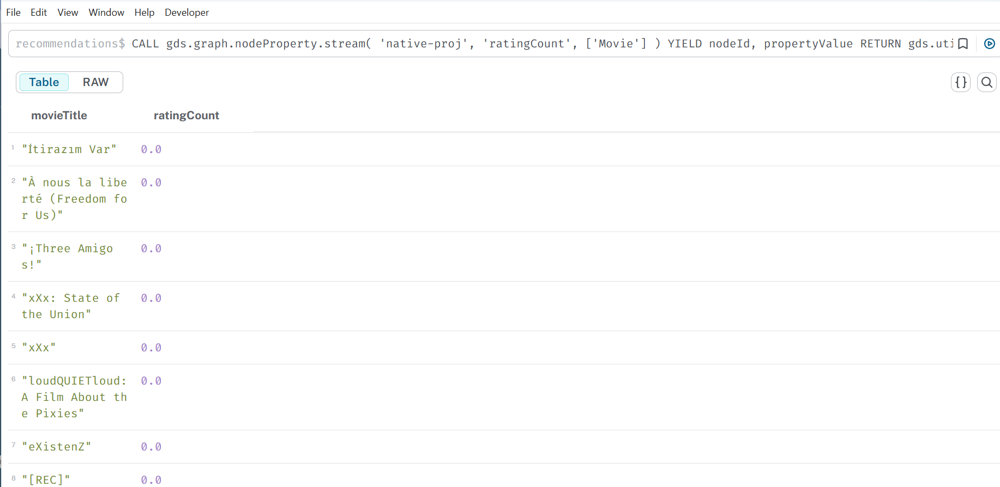
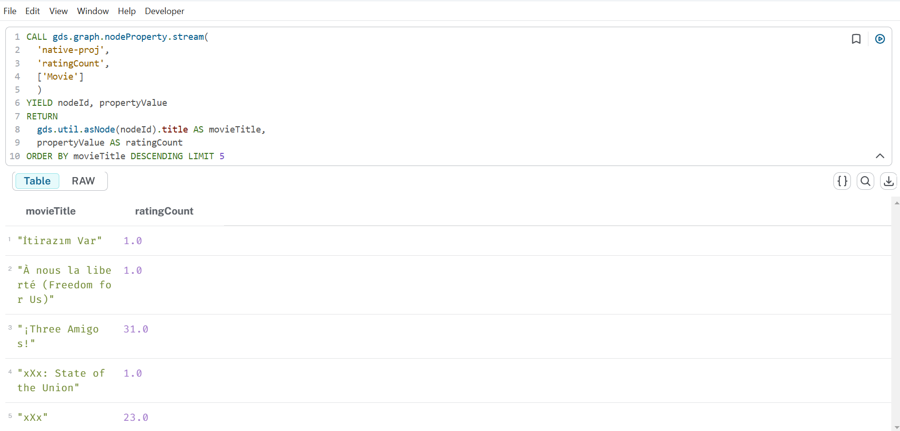
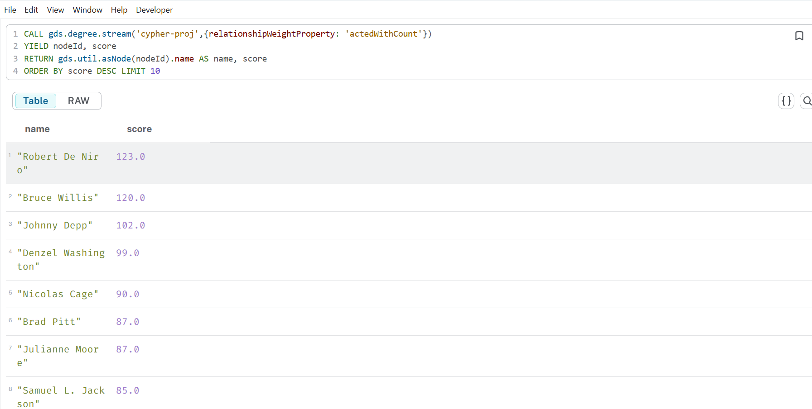

= GDS

== Dataset movie recommendations

==== Etapes à suivre

. Stop votre instance sorbonne
. Copier le fichier recommendations.dum dans le dossier import
. Ouvrir une terminal à partir du dossier bin de votre instance
. Executer la commande suivante en donnant le chemin complet du dossier import

----
.\neo4j-admin.bat database load recommendations --from-path="path complete du dossier import"  --overwrite-destination=true

----

Exemple :

----
.\neo4j-admin.bat database load recommendations 
    --from-path="C:\Users\33641\.Neo4jDesktop2\Data\dbmss\dbms-e800f016-787d-41ee-bc75-dba76f3265dd\import"  
    --overwrite-destination=true
----

. Start votre instance sorbonne
. Se connecter sur la base recommendations
. 

== Executer la requete : Lister les projections existantes

----
CALL gds.graph.list()
----

. 

Executer la requete : Creation d'une projection 

----
   CALL gds.graph.project(
  'my-graph-projection',
  ['Actor','Movie'],
  'ACTED_IN'
  )
----

. 

Executer la requete : Lister les projections existantes

----
   CALL gds.graph.list()
----

Resultat :
image:img.png[img.png]
. Executer la requete

----
   CALL gds.graph.list()
    YIELD graphName, nodeCount, relationshipCount, schema
----

Resultat :
image:img_1.png[img_1.png]

. Degree centrality sur les nodes Actor

----
   CALL gds.degree.mutate('my-graph-projection', {mutateProperty:'numberOfMoviesActedIn'})
   
----

Resultat :
image:img_2.png[img_2.png]

. Streaming

----
   CALL gds.graph.nodeProperty.stream(
      'my-graph-projection',
      'numberOfMoviesActedIn'
      )
    YIELD nodeId, propertyValue
    RETURN
      gds.util.asNode(nodeId).name AS actorName,
      propertyValue AS numberOfMoviesActedIn
      ORDER BY numberOfMoviesActedIn DESCENDING, actorName LIMIT 10
----

Resultat :
image:img_4.png[img_4.png]

. Ecriture

----
  CALL gds.graph.nodeProperties.write(
  'my-graph-projection',
  ['numberOfMoviesActedIn'],
  ['Actor']
  )
   
----

Resultat :
image:img_5.png[img_5.png]

----
    MATCH (a:Actor)
    RETURN a.name, a.numberOfMoviesActedIn
    ORDER BY a.numberOfMoviesActedIn DESCENDING, a.name LIMIT 10
   
----

Resultat :
image:img_6.png[img_6.png]

== GDS Native projection

La projection native permet de gérer la direction des Relationships
Pour cela :

NATURAL: Meme direction que ce qui est dans database (default)
REVERSE: direction opposée
UNDIRECTED: undirected

Prenons l'exemple du Graph que nous venons de projeter. Imaginons que nous souhaitions compter le nombre d'évaluations attribuées à chaque film par les utilisateurs. Si nous utilisons l'appel de degré comme lors de la dernière leçon, nous obtiendrons uniquement des zéros.

----
    CALL gds.graph.drop('native-proj', false);
    CALL gds.graph.project(
      'native-proj',
      ['User', 'Movie'],
      ['RATED']
      );
    CALL gds.degree.mutate(
      'native-proj',
      {mutateProperty: 'ratingCount'}
      );
   
----

Resultat :

----
  CALL gds.graph.nodeProperty.stream(
  'native-proj',
  'ratingCount',
  ['Movie']
  )
    YIELD nodeId, propertyValue
    RETURN
      gds.util.asNode(nodeId).title AS movieTitle,
      propertyValue AS ratingCount
    ORDER BY movieTitle DESCENDING LIMIT 10
   
----

Ce résultat est lié à la direction de la RelationShip

Pour Corriger ce probléme :

----
CALL gds.graph.drop('native-proj', false);

//replace with a project that has reversed relationship orientation
CALL gds.graph.project(
    'native-proj',
    ['User', 'Movie'],
    {RATED_BY: {type: 'RATED', orientation: 'REVERSE'}}
  );

CALL gds.degree.mutate(
  'native-proj',
  {mutateProperty: 'ratingCount'}
  );
----

Resultat :

----
CALL gds.graph.nodeProperty.stream(
  'native-proj',
  'ratingCount',
  ['Movie']
  )
YIELD nodeId, propertyValue
RETURN
  gds.util.asNode(nodeId).title AS movieTitle,
  propertyValue AS ratingCount
ORDER BY movieTitle DESCENDING LIMIT 5
----

== GDS Cypher projection

Dans la partie Native projection , nous avons déterminé quels acteurs étaient les plus prolifiques en fonction du nombre de films dans lesquels ils ont joué.
Supposons plutôt que nous souhaitions savoir quels acteurs sont les plus influents en termes de nombre d'autres acteurs avec lesquels ils ont joué dans des films récents à gros budget.

Pour cet exemple, nous qualifierons un film de «RECENT» s'il est sorti en 1990 ou après, et de gros budget s'il a généré des recettes supérieures à 1million de dollars.

Le Graph n'est pas configuré pour répondre correctement à cette question avec une projection native directe.
Cependant, nous pouvons utiliser une projection chiffrée pour filtrer les nœuds appropriés et effectuer une agrégation afin de créer une relation ACTED_WITH
dont la propriété actedWithCount relie directement les nœuds acteurs.

. Requete cypher

----
// requete cypher
    MATCH (source:Actor)-[r:ACTED_IN]->(m:Movie)<-[:ACTED_IN]-(target)
    WHERE m.year >= 1990 AND m.revenue >= 1000000
    RETURN source.name, count(r) as actedWithCount
----

. Creation de la projection

----
// Creation de la projection 
    MATCH (source:Actor)-[r:ACTED_IN]->(m:Movie)<-[:ACTED_IN]-(target)
    WHERE m.year >= 1990 AND m.revenue >= 1000000
    WITH source, target, count(r) as actedWithCount
    WITH gds.graph.project(
        'cypher-proj',
        source,
        target,
        { relationshipProperties:
            {
                actedWithCount: actedWithCount
            }
        }
    ) AS g
    RETURN
      g.graphName AS graph, g.nodeCount AS nodes, g.relationshipCount AS rels

----

. Application de Degree centrality

----
// Degree centrality 
    CALL gds.degree.stream('cypher-proj',{relationshipWeightProperty: 'actedWithCount'})
    YIELD nodeId, score
    RETURN gds.util.asNode(nodeId).name AS name, score
    ORDER BY score DESC LIMIT 10
----

Resultat :

