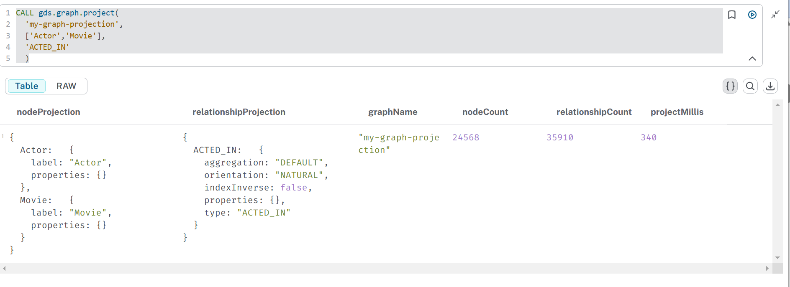
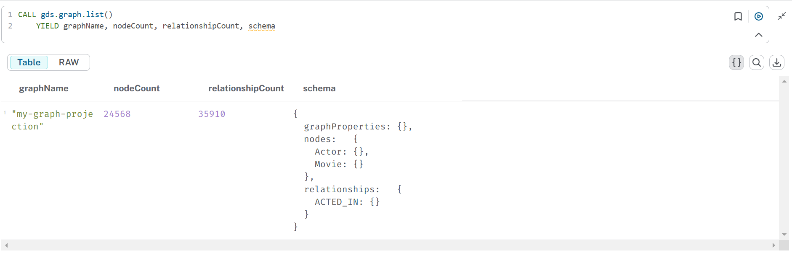
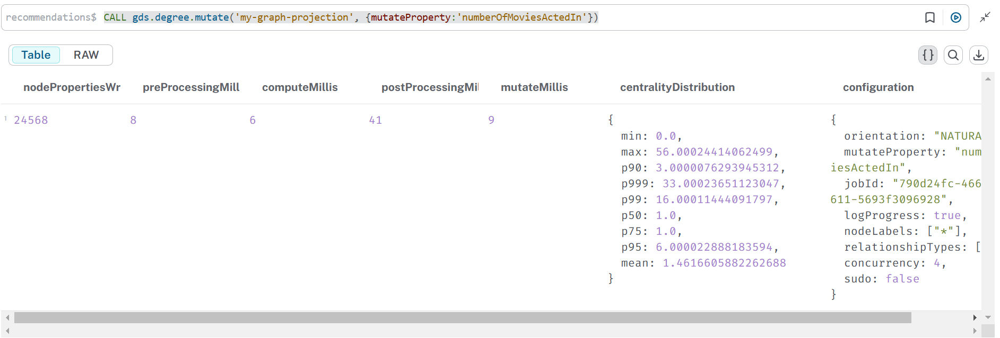
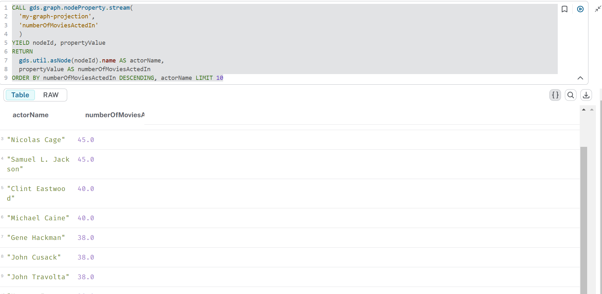
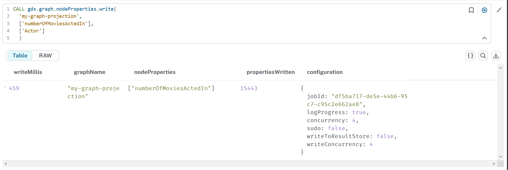
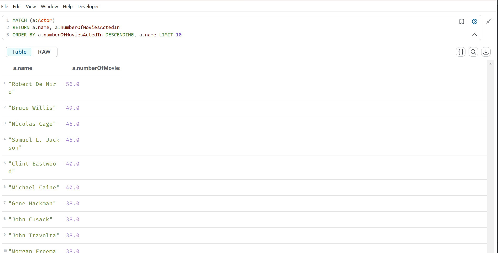

# GDS movie recommendations
### Etapes à suivre
1. Stop votre instance sorbonne
2. Copier le fichier recommendations.dum dans le dossier import
3. Ouvrir une terminal à partir  du  dossier bin de votre instance
4. Executer la commande suivante en donnant le chemin complet du dossier import

```
.\neo4j-admin.bat database load recommendations --from-path="path complete du dossier import"  --overwrite-destination=true

```
Exemple :
```
.\neo4j-admin.bat database load recommendations 
    --from-path="C:\Users\33641\.Neo4jDesktop2\Data\dbmss\dbms-e800f016-787d-41ee-bc75-dba76f3265dd\import"  
    --overwrite-destination=true
```
6. Start votre instance sorbonne
7. Se connecter sur la base  recommendations
8. Executer la requete : Lister les projections existantes
----
```
    CALL gds.graph.list()
```
9. Executer la requete : Creation d'une projection 
```
   CALL gds.graph.project(
  'my-graph-projection',
  ['Actor','Movie'],
  'ACTED_IN'
  )
```
10. Executer la requete : Lister les projections existantes
```
   CALL gds.graph.list()
```
Resultat :


11. Executer la requete
    
```
   CALL gds.graph.list()
    YIELD graphName, nodeCount, relationshipCount, schema
```
Resultat :


12.  Degree centrality sur les nodes Actor

```
   CALL gds.degree.mutate('my-graph-projection', {mutateProperty:'numberOfMoviesActedIn'})
   
```
Resultat :


13. Streaming

```
   CALL gds.graph.nodeProperty.stream(
      'my-graph-projection',
      'numberOfMoviesActedIn'
      )
    YIELD nodeId, propertyValue
    RETURN
      gds.util.asNode(nodeId).name AS actorName,
      propertyValue AS numberOfMoviesActedIn
      ORDER BY numberOfMoviesActedIn DESCENDING, actorName LIMIT 10
```
Resultat :


14. Ecriture 

```
  CALL gds.graph.nodeProperties.write(
  'my-graph-projection',
  ['numberOfMoviesActedIn'],
  ['Actor']
  )
   
```
Resultat :



```
    MATCH (a:Actor)
    RETURN a.name, a.numberOfMoviesActedIn
    ORDER BY a.numberOfMoviesActedIn DESCENDING, a.name LIMIT 10
   
```
Resultat :
