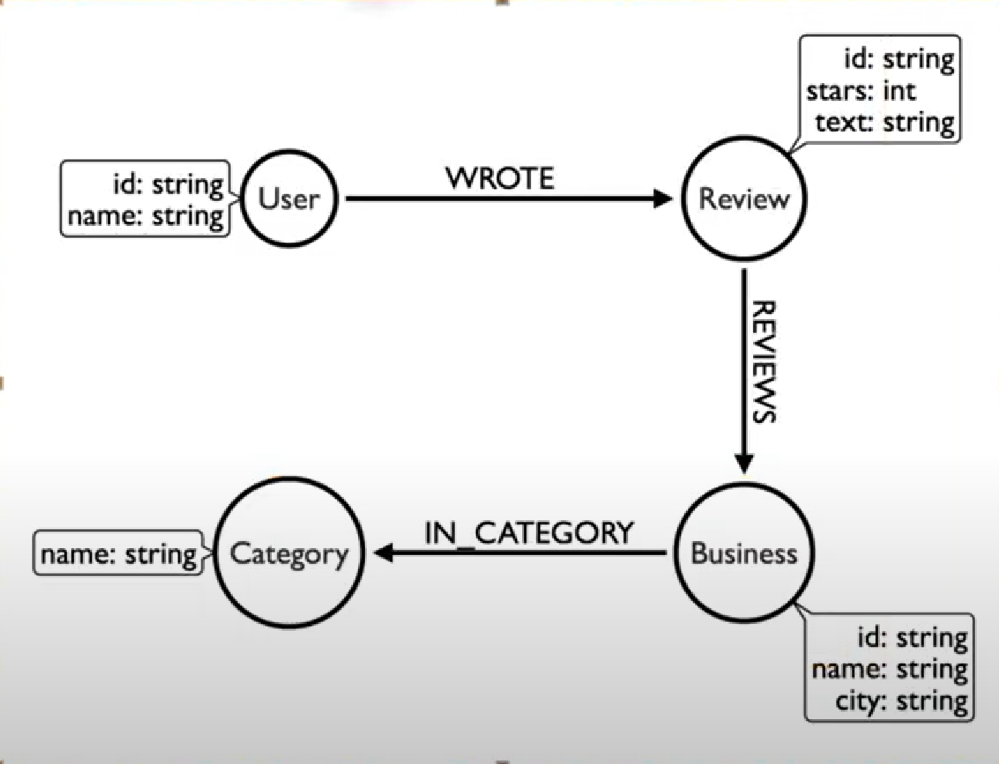

= Sujet :

Ce projet à pour objectif de vous familiariser aux procedures de modelisation et d'import
de données brutes dans neo4j.

[Note]
La source de la dataset vient  Yelp. https://business.yelp.com/data/resources/open-dataset/
Qui fournit un ensemble de data Open pour des usages divers.
Fichier format zip est fourni avec le contenu complet des données.

== Votre tache
Vous allez essayer de lire et de comprendre la structure des données fournies.
Construire des requetes cypher d'import des données dans neo4j.
Le Modele final des données dans neo4j doit etre conforme à :

== Recommendations
Vous pouvez vous inspirer de ce qui est fait sur la dataset stackoverflow en classe
Vous etes libre de données le nom que vous souhaitiez à votre base de donnée.
Exemple : yelp comme le nom de la source qui fournit ces données.
Les requetes cypher cles pour l'import :

----
1 . apoc.load.json
2 . UNWIND
3. MERGE
----

== Optionnel
Ce n'est pas une necessité mais je vous donne la requte qui vous permet
de figer le schema de votre base avant import des données.
----
call apoc.schema.assert({Category:['name'],Business:['name']},
{Business:['id'],User:['id'],Review:['id']}
);
----

== Analyse et exploration de la données

Vous avez la possibilité  de charger une partie de la données
sans persistence.
Exemple :
[source,cypher]
----
call apoc.load.json('file:///D:/yelp/yelp_dataset/yelp_academic_dataset_business.json')
  yield value
  return value limit 25
----

== 1. Creation des noeuds Business et Categories et relationships IN_CATEGORY

[source,cypher]
----
//Requete cypher à fournir

----

== 2. Creation des noeuds User et relationships FRIENDS

[source,cypher]
----
//Requete cypher à fournir

----

== 3. Creation des REVIEW User et relationships REVIEWS et WROTE

[source,cypher]
----
//Requete cypher à fournir

----

== 4. Appliquer les algorithmes GDS pour sortir les metriques plus interressantes permettants de faire de la recommendations de produit.

----
//Requete cypher à fournir

----

== 5. Expliquer votre choix
